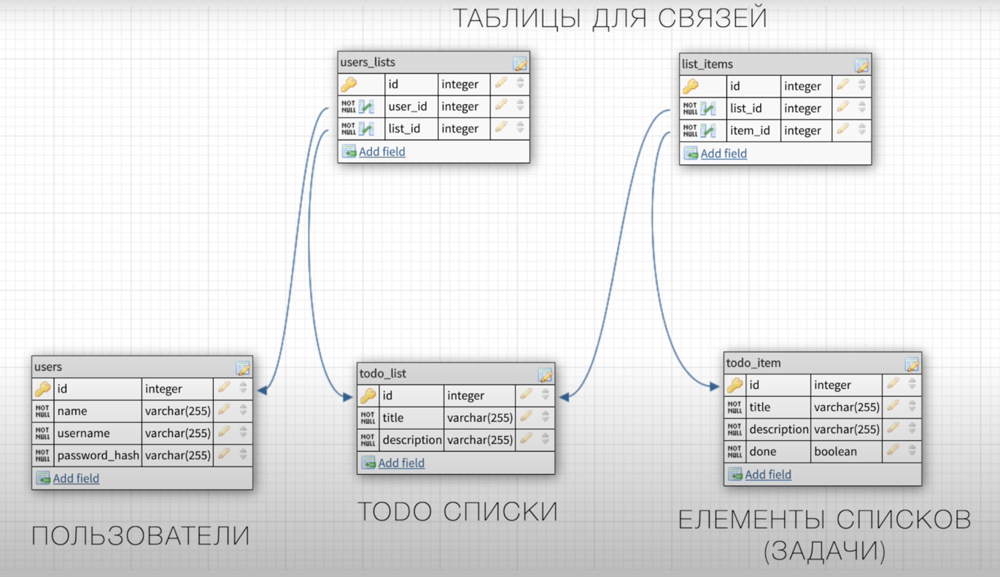
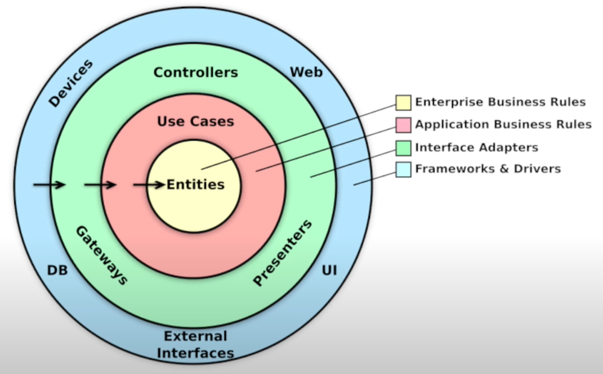
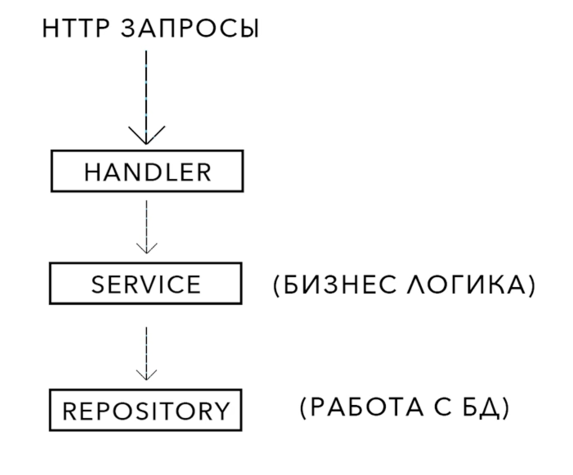
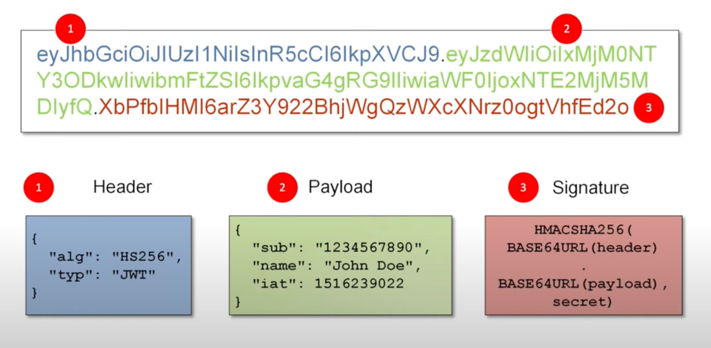

## Цель. Создать todo приложение

### Функционал
* Создать todo приложение
* Бесконечное кол-во списков дел
* Бесконечное кол-во элементов для списков
* Будут методы для регистрации и авторизации: ```POST /AUTH/SING-UP```, ```POST /AUTH/SIGN-IN```
* Методы создания, просмотра, удаления списков и задач: ```GET /LISTS```, ```GET /LISTS{ID}```, ```POST /LISTS```,
  ```PUT /LISTS{ID}```, ```DELETE /LISTS{ID}```, ```GET /LISTS{ID}/ITEMS```, ```POST /LISTS{ID}/ITEMS```
* Методы для работы с методами списков: ```PUT /ITEMS{ID}```, ```GET /ITEMS{ID}```, ```DELETE /ITEMS{ID}```




### Базовая структура проекта. HTTP-Сервер

#### Шаг 1. Папки
* В папку ```cmd``` помещаю главный файл: ```main.go```
* Создаю папку ```pkg```, в ней будет храниться вся логика приложения
* Внутри нее создаю: ```handler```, ```repository```, ```service``` 

#### Шаг 2. Верхний уровень
Лучше всего хранить файлы с описанием структур и сущностей, которые будут использоваться по всему проекту, на верхнем уровне
* Создаю файл ```server.go```, где объявляю ```Server struct``` и два его метода
* Создаю файл ```user.go```, где объявляю ```User struct``` для пользователей
* Создаю файл ```todo.go```, и объявляю несколько todo сущностей

#### Шаг 3. Хендлеры
* Создаю файл ```handler.go``` и начинаю имплементировать исполнителей в методе ```InitRoutes()```
* Устанавливаю фреймворк: ```go get -u github.com/gin-gonic/gin```, он более шустрая замена стандартного пакета net/http
* В директории handler создаю ```auth.go``` в котором описываю пустые хендлеры для эндпоинтов регистрации и авторизации
* По аналогии создаю пустые хендлеры для ```list.go``` и ```item.go```
* Дописываю эндпоинты в ```InitRoutes()```, указывая нужные хендлеры для групп


### Чистая Архитектура. Внедрение Зависимостей.

#### Шаг 1. Теория
* Суть ```чистой архитектуры``` заключается, в правильном разделении ответственности между всеми слоями приложения, 
что позволяет увеличить безопасность, гибкость, упрощает тестирование и масштабирование.
* Зависимости могут быть направленны только внутрь, центральный круг ничего не должен знать про внешний.

* Внедрение зависимостей


#### Шаг 2. Реализация
* Создаю файл `pkg/service/service.go`, объявляю заголовки интерфейсов для сущностей, создаю структуру и конструктор, указывающий на бд 
* Создаю файл `pkg/repository/repository.go` и объявляю заголовки интерфейсов для сущностей 
* Добавляю в `Handler struct` поле с указателем на сервис: `services *service.Service` и генерирую конструктор
* В мейне создаю три сущности: `repos`, `services`, `handlers`, где одна зависит от другой согласно фото


### Запуск Postgres в Docker. Файлы миграций. Конфигурации приложения.

#### Шаг 1. config.yml
* Чтобы задать базовую настройку сервера, создаю `/configs/config.yml`
* Устанавливаю библиотеку для работы с конфигами: `go get -u github.com/spf13/viper`
* В main.go создаю функцию `initConfigs()`
* Вызываю ее вначале кода и в качестве аргумента для `srv.Run()`

#### Шаг 2. Postgres
* Устанавливаю образ postgres: `docker pull postgres`
* Запускаю контейнер: `docker run --name=todo-db -e POSTGRES_PASSWORD=1111 -p 5436:5432 -d postgres`

#### Шаг 3. Миграция
`Миграции` - что-то вроде системы контроля версий, которая позволяет переходить от одной структуры бд к другой без потери консистентности
* Установка расширения: https://github.com/golang-migrate/migrate/blob/master/cmd/migrate/README.md
* Создание миграционного репозитория ```migrate create -ext sql -dir schema -seq init```(-какое_расширение скл -куда_сложить папка название_файлов).
В данном репозитории будет находиться up/down пары sql миграционных запросов к бд.
* В файл up вписываются команды по заполнению бд, а в down откаты
* Применяю миграцию `migrate -path schema -database "postgres://localhost:5436/postgres?sslmode=disable&user=postgres&password=1111" up`


### Подключение к БД из приложения. Переменные окружения. Библиотека sqlx

#### Шаг 1. sqlx
* Эта библиотека является надстройкой к стандартной библиотеке, и упрощает работу с бд
* Установка: `go get -u github.com/jmoiron/sqlx`

#### Шаг 2. Подключение к бд из приложения
* Создаю файл `pkg/repository/postgres.go` в нем реализую метод `NewPostgresDB()`, который и будет подключаться к бд
* В файле repository.go добавляю аргумент `db *sqlx.DB` к методу `NewRepository()`
* Переношу в `config.yml` параметры подключения к бд
* В main.go создаю и инициализирую `db`, а значения для подключения получаю из внутреннего объекта вайпера

#### Шаг 3. Пароль
Нельзя хранить пароль для подключения к бд в открытом доступе. Чтобы избавиться от этой проблемы, используют переменные окружения
* Установка специальной библиотеки: `go get -u github.com/joho/godotenv`
* Создаю файл `.env`, где указываю параметр для пароля
* В main.go загружаю все переменные окружения с помощью `godotenv.Load()`, а пароль передаю с помощью `os.Getenv()`


### Регистрация пользователей

#### Шаг 1. Общее
* Добавляю библиотеку для логирования: `go get -u github.com/sirupsen/logrus`, она лучше стандартной
* В файле user.go задаю полям структуры значение `binding:"required"`(обязательно заполнить)
* Создаю файл `pkg/handler/response.go` и структуру для вывода ошибок 

#### Шаг 2. Реализация auth.go
1. В `handler/auth.go` реализую метод `signUp()`

2. После, запрос передается в бизнес логику(service)
* В `service/service.go` в `Authorization interface` описываю метод `CreatUser()`
* Создаю файл `service/auth.go` в котором имплементирую этот метод. В нем же будут реализованны все основные функции,
например `generatePasswordHash()`
* В конструкторе сервиса `NewService()` даю полю Authorization значение из метода `NewAuthService()`

3. Данные о пользователе передаются уже в repository, где будет взаимодействие с бд 
* В `repository/repository.go` тоже описываю метод `CreatUser()`
* Создаю файл `repository/auth_postgres.go`, внутри которого реализую этот метод
* В констуркторе репозитория `NewRepository()` даю полю Authorization значение из метода `NewAuthPostgres()`

4. Дописываю оставшийся код в `signUp()`


#### Шаг 3. Обобщение
* Первый уровень указывает на логику - `handler.go/Handler struct` указывает на `servive.go/Service struct`
* Сами вторые уровни никуда не ведут - `Service struct` и `repository.go/Repository struct` никуда не указывают, они содержат только поля своих интерфейсов
* И уже `service/auth.go` указывает на интерфейс авторизации в репозитории `repo repository.Authorization`
* А `repository/auth_postgres.go` на базу данных `db *sqlx.DB`
* В этих трёх "главных" файлах ничего не реализуется, вся работа происходит в "помощниках": `handler/auth.go`, `service/auth.go`, `repository/auth_postgres.go`
* В `postgres.go` происходит подключение к бд


### Аутентификация. JWT-токены
 
#### Шаг 1. Теория
`JWT (JSON Web Token)` — это компактный и самодостаточный способ передачи информации между сторонами в виде JSON-объектов. Такие объекты передаются при каждом запросе от клиента к серверу, когда нужно понять кто его прислал.


JWT состоит из трех частей, разделенных точками, каждая из которых закодирована в формате Base64: `HEADER.PAYLOAD.SIGNATURE`

* `Header` (заголовок): хранит метаинформацию, например, о типе токена и алгоритме подписи.
* `Payload` (полезная нагрузка): содержит информацию (claims), которую вы хотите передать: данные пользователя, ID пользователя, имя пользователя, срок действия токена.
* `Signature` (подпись): создается путем объединения закодированных строк Header и Payload и их подписи с использованием секретного или приватного ключа. 
Используется для проверки подлинности токена и целостности данных.



*Как JWT используется для аутентификации.*

Аутентификация - это процесс проверки подлинности чего-либо. В нашем случае это проверка пароля к логину

Авторизация:
* После успешной авторизации пользователя сервер генерирует JWT, содержащий данные пользователя.
* Токен отправляется клиенту (обычно в заголовке HTTP или cookie), и удаляется с сервера.

Аутентификация:
* При каждом запросе к защищенному ресурсу клиент отправляет JWT.
* Сервер генерирует новую подпись токена и сравнивает с полученной и, если она корректна, предоставляет доступ к ресурсу.


#### Шаг 2. Реализация
* Устанавливаю библиотеку по работе с jwt: `go get -u github.com/dgrijalva/jwt-go`

1. В `handler/auth.go` создаю структуру `signInInput` для получения логина и пароля, и реализую  метод `signIn()`

2. Бизнес логика 
* В `service/service.go` в `Authorization interface` создаю сигнатуру `GenerateToken()`
* В `service/auth.go` реализую этот метод и добавляю `TokenClaims struct` для новых claims 

3. Репозиторий - необходимо получить пользователя из бд
* В `repository/repository.go` в `Authorization interface` создаю сигнатуру `GetUser()`
* Реализую этот метод в `repository/auth_postgres.go`

4. Дописываю оставшийся код в `signIn()`


### Парсинг JWT-токенов. Middleware аутентификации

`Middleware аутентификация` — это промежуточный слой, который обрабатывает HTTP-запросы перед
тем, как они попадут в основную логику обработки. В контексте аутентификации middleware проверяет, является ли запрос от авторизованного пользователя, и если нет — блокирует доступ к защищённым ресурсам.

Принцип работы middleware аутентификации
1. Получение и проверка токена: он может быть отправлен в заголовке запроса, в cookies или других местах. 
2. Проверка валидности, парсинг: проверяет, действителен ли токен и не истек ли его срок. Для JWT токенов также проверяется подпись. 
3. Идентификация пользователя: может извлечь информацию о пользователе из токена (например идентификатор) и добавить её в контекст запроса, для других частей. 
4. Доступ или отказ: Если проверка аутентификации успешна, запрос передается дальше в цепочку, обычно в конечную точку обработки (например, в обработчик запроса). Если токен отсутствует или недействителен, может возвращать ошибку (например, 401 Unauthorized) и остановить дальнейшую обработку.

#### Реализация
1. Создаю файл `handler/middleware.go` и реализую в нем метод `userIdentity()`
2. В `service/service.go` в `Authorization interface` добавляю метод `ParseToken()`, а реализую его в `service/auth.go`
3. Дописываю `userIdentity()`
4. Добавляю этот метод в роутер группы по работе с задачами в `handler.go`
5. И уже после авторизации пользователь получит адрес "/api", где каждый раз будет вызываться проверка токена
6. Добавляю этот метод в роутер `api` в `handler.go`, где каждый раз для авторизированного пользователя будет вызываться проверка токена
